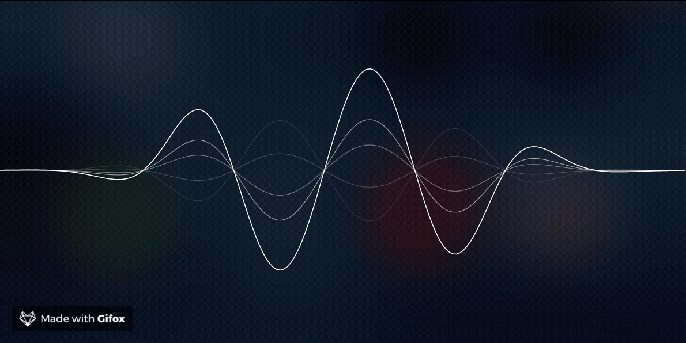

# SiriWave

The "Apple Siri" wave replicated in pure Javascript using the Canvas API.

[Read blog post here](https://developers.caffeina.com/how-i-built-siriwavejs-library-maths-and-code-behind-6971497ae5c1)

[View live example](http://kopiro.github.io/siriwave)

[](https://badge.fury.io/js/siriwave)

### Classic style



### iOS 9+ style


## Usage

### Browser (via CDN) usage

```html
<script src="https://unpkg.com/siriwave/dist/siriwave.umd.min.js"></script>
```

### ES module

Install it through `npm install siriwave` or `yarn add siriwave` first:

```js
import SiriWave from "siriwave";
```

## Instantitate

Create a div container and instantiate a SiriWave object

```html
<div id="siri-container"></div>
<script>
  var siriWave = new SiriWave({
    container: document.getElementById("siri-container"),
    width: 640,
    height: 200,
  });
</script>
```

## Constructor options

| Key        | Type          | Description                                                            | Default    | Required |
| ---------- | ------------- | ---------------------------------------------------------------------- | ---------- | -------- |
| container  | DOMElement    | The DOM container where the DOM canvas element will be added.          | null       | yes      |
| style      | "ios", "ios9" | The style of the wave.                                                 | "ios"      | no       |
| ratio      | Number        | Ratio of the display to use. Calculated by default.                    | calculated | no       |
| speed      | Number        | The speed of the animation.                                            | 0.2        | no       |
| amplitude  | Number        | The amplitude of the complete wave-form.                               | 1          | no       |
| frequency  | Number        | The frequency of the complete wave-form. Only available in style "ios" | 6          | no       |
| color      | String        | Color of the wave. Only available in style "ios"                       | "#fff"     | no       |
| cover      | Bool          | The `canvas` covers the entire width or height of the container        | false      | no       |
| autostart  | Bool          | Decide wether start the animation on boot.                             | false      | no       |
| pixelDepth | Number        | Number of step (in pixels) used when drawed on canvas.                 | 0.02       | no       |
| lerpSpeed  | Number        | Lerp speed to interpolate properties.                                  | 0.01       | no       |

## API

#### `start()`

Start the animation

#### `stop()`

Stop the animation.

#### `setSpeed(newValue)`

Set the new value of speed (animated)

#### `setAmplitude(value)`

Set the new value of amplitude (animated)

## Grapher plots

- [GCX default](etc/gcx/default.gcx)
- [GCX iOS 9](etc/gcx/ios9.gcx)
